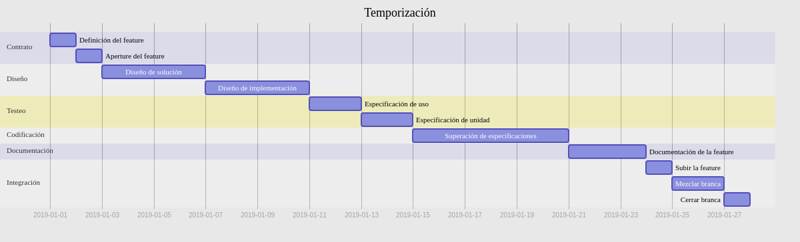

# Reactivist: una plantila de proyecto para componentes React

***Reactivist*** es una nueva *plantila de proyecto para componentes React* basada en:

|Parte |Contribución |
|--------------:|------------------|
| **Componentes:** | React |
| **Eventos:** | Redux |
| **Estilos:** | Sass |
| **Módulos:** | Browserify |
| **Tests de usuario:** | Cypress |
| **Tests unitarios:** | QUnit/Electron |
| **Cobertura de código:** | NYC |
| **Documentación:** | Javadoc/Markdown/Mermaid |
| **Desarrollo:** | Grunt/Chokidar/Socket.io/... |
| **Incluye:** | Flujos de trabajo definidos |
|  | Comandos por defecto y personalizables |
|  | Configuraciones de los comandos |
|  | Configuraciones de entorno |
|  | Tests unitarios en vivo |
|  | Tests de usuario en vivo |
|  | Simples pero avanzadas herramientas |
|  | Método de trabajo definido |

# Índice

1. [Índice](#indice)
2. [Instalación](#instalación)
3. [Referencia de la CLI](#referencia-de-la-cli)
4. [Arquitectura](#arquitectura)
5. [Requisitos](#requisitos)
6. [Flujos de trabajo](#flujos-de-trabajo)
7. [Referencia de la API](#referencia-de-la-api)
8. [Tests de usuario](#tests-de-usuario)
9. [Tests unitarios](#tests-unitarios)
10. [Comandos](#comandos)
11. [Cambios](#changelog)
12. [Licencia](#licencia)

# Instalación

Para instalar la herramienta `reactivist` sólo tienes que ejecutar en tu línea de comandos:

~$ `npm install --save-dev reactivist`


Si quieres poder ejecutar el comando de CLI de `reactivist` en cualquier parte fácilmente:

~$ `npm install --global reactivist`


# Referencia de la CLI

Para crear un nuevo proyecto `reactivist`, simplemente ejecuta en línea de comandos:

```
 ~$ reactivist --folder "src/components/MyNewComponent" 
```

Optionalmente, se pueden proporcionar estas opciones:

```
    [--name "MyNewComponent"]             # Nombre general
    [--package "my-new-component-module"] # Nombre del paquete npm, para el package.json#name
```

Entonces, los ficheros de un proyecto `reactivist` básicos se copiarán, y las dependencias correspondientes se instalarán (en un proyecto nuevo, si es necesario).


# Arquitectura

La arquitectura del proyecto se crea a partir de saber qué debe cumplir éste.

En esta guía se hablará de: 

 - requisitos
 - soluciones
 - herramientas
 - implementaciones
 - ventajas
 - desventajas
 - otros temas


## Requisitos

`Reactivist` se creó para cumplir unos objetivos.

- Crear proyectos de componentes web...:
   - open source
   - reusables
   - mantenibles
   - escalables
   - hechos rápidamente
   - con sintaxis avanzadas
   - con dependencias comunes 
   - con sistema de módulos y dependencias flexible
   - con manejo de estilos con lógica y escalable
   - con comandos típicos del desarrollo incorporados 
   - con manejo de internacionalización
   - con manejo fluído de documentación
   - con entornos para tests de usuario
   - con entornos para tests unitarios
   - con cobertura de código incorporada en los tests
   - con flujos de trabajo definidos
   - con documentación suficiente
   - con entorno asistido de compilación/transpilación
   - que, sobre todo:
      - delimite claramente el área de trabajo del desarrollador
      - facilite la trazabilidad del trabajo
      - facilite el uso de buenas prácticas mucho


El nivel de detalle de los puntos es superficial. Sin embargo, en las soluciones se expondrán más en profundidad.


## Soluciones

Las soluciones que pretende aportar `Reactivist` se definen en función de los requisitos para los que se pensó.

Por eso, listaremos los requisitos, y explicaremos a continuación las soluciones que se proponen en los proyectos basados en `Reactivist`.

### open source

El código se puede encontrar en `github` y es un módulo de `npm` también. Además, genera módulos `npm` compatibles con `browserify`.

### reusables

Los componentes se desarrollarían en `react`.

### mantenibles

Los componentes sobreentenderían el uso de `redux`, `react-redux`, `redux-thunk`, y probablemente más.

Con `react` conseguiríamos sistemas de plantillas (estaticidad).

Con `redux` conseguiríamos sistemas de eventos (dinamicidad).

Con `react-redux` conseguiríamos conectar más fácilmente los anteriores.

Con `redux-thunk` conseguiríamos lanzar eventos asíncronamente.

### escalables

Los componentes se podrían usar unos dentro de otros gracias a `react`.

Los eventos podrían convivir entre componentes si:

   - se define un sistema de espacios de nombres
   - se implementa a la hora de desarrollar componentes

### hechos rápidamente

Se podrían crear nuevos proyectos `Reactivist` o componentes `Reactivist` (que equivaldrían a lo mismo) desde la línea de comandos muy fácilmente.

### con sintaxis avanzadas

Se utilizaría una sintaxis `es6` con `babel`.

Se utilizaría un preset preparado especialmente para sintaxis `jsx` de `react`.

Se utilizaría una sintaxis para los estilos `sass` con ficheros `scss`.

Se utilizaría una sintaxis específica familiar o similar a `cucumber` (no implementado) para definir los tests de usuario.

Se utilizaría una sintaxis de marcado como `markdown` para generar documentación estéticamente flexible.

Se utilizaría una sintaxis de gráficos como `mermaid` para generar documentación basada en gráficos, esquemas y diagramas.

Se utilizarían sintaxis básicas de desarrollo web como `html`, `css` y `js`.

Se utilizarían sintaxis de documentos estáticos como `json`, `yaml`, `xml`, etc.

### con dependencias comunes

Se utilizaría un sistema de módulos externos como `npm`, el cual ya gestiona la interdependencia de módulos a nivel de proyectos.

Se utilizaría un sistema de módulos externas como `browserify` a nivel de lógica pura de aplicación. `import`, `ScriptLoader`, `window`.

Se utilizaría un sistema de módulos externas como `sass` a nivel de lógica de estilos de la aplicación. `@import {file/npm module/url}`.

### con sistema de módulos y dependencias flexible

Con `npm` podríamos manejar los módulos que estarían disponibles en `node.js`, `browserify` y `sass`.

### con manejo de estilos con lógica y escalable

Con `sass` podríamos crear módulos con lógica, subirlos a `npm` y reusarlos. 

### con comandos típicos del desarrollo incorporados 

Con `grunt` y `gruntfile.js` los ficheros `dev/grunt:*.js` son automáticamente comandos disponibles ejecutando `grunt *`.

### con manejo de internacionalización

Los ficheros `i18n/*.po` pueden integrarse en el desarrollo con el comando `grunt i18n`.

### con manejo fluído de documentación

El comando `grunt docs` generará toda la documentación que nosotros le vayamos configurando en `settings.json`.

Para ello usamos `javadoc` para extraer la documentación de los comentarios `js`, y `mermaid` para generar gráficos.

### con entornos para tests de usuario

Los tests de usuario son ejecutados mediante `grunt e2e`, y usarían `cypress` ( + `mocha` + `chai` + ...).

Los tests de usuario pueden ser escritos desde `test/e2e/integration/*.test.jsx`.

### con entornos para tests unitarios

Los tests unitarios son compilados e integrados en la aplicación (en entorno `"test"` solamente) desde `test/unit/dist/bundle.*`.

Los tests unitarios pueden ser escritos desde `test/unit/src/index.jsx`.

### con cobertura de código incorporada en los tests

Los tests unitarios generarían reportes de cobertura de código a todos los ficheros bajo `src/*` que fueran usados en los tests.

Los tests unitarios generarían reportes de cobertura de código en `unit/coverage`.

### con flujos de trabajo definidos

En la carpeta `docs/workflows` se especifican los flujos de trabajo contemplados para cualquier proyecto.

### con documentación suficiente

Tenemos múltiples ficheros esparcidos por la aplicación que son explicativos y se integran en la documentación de manera automática (con `grunt docs`).

Todos los ficheros `*.md` (para `markdown`) y `*.mmd` (para `mermaid`) están exclusivamente destinados a la documentación.

También se genera documentación de los comentarios `javadoc` del código fuente, los estilos y los tests (todo configurable).

Toda la documentación generada está configurada para unificarse en el `README.md` del proyecto ordenadamente.

### con entorno asistido de compilación/transpilación

Podríamos iniciar el modo desarrollo con los comandos `grunt serve` y `grunt watch` paralelamente.

### que delimite claramente el área de trabajo del desarrollador

Los flujos están desarrollados más en profundidad en la carpeta de `docs/workflows`.

Todo el proyecto está pensado para que el programador sepa qué debe hacer en cada momento, para que no pierda tiempo en el desarrollo por inexperiencia.

### que facilite la trazabilidad del trabajo

Los flujos de trabajo ya contemplan el uso de estos ficheros que, a medida que se va avanzando en el proyecto, se va quedando registrado toda la actividad.

El control de versiones es una herramienta más del flujo de trabajo, y ella más que ninguna determina la trazabilidad.

### que facilite el uso de buenas prácticas mucho

Buena parte de la documentación se genera de documentar el código, cosa que tradicionalmente es una buena práctica.

El proyecto, de base, ya prevee que vas a utilizar herramientas que son bastante avanzadas ahora mismo en el mercado, como `browserify`, `jsx` con `react`, o `redux`. No obstante, hay que decir que es bastante agnóstico en qué tipo de herramienta quieres desarrollar, y por tanto las buenas prácticas, en tanto que código, no están especialmente contempladas en este proyecto. Sin embargo, se brindan muchas herramientas para que se pueda desarrollar cómodamente esta parte del proceso, como la autogeneración de documentación con lenguaje de marcado o un lenguaje específicamente preparado para generar mapas conceptuales, gráficos y árboles.

Los flujos de trabajo están pensados precisamente para que, siguiendo las buenas prácticas, el programador se sitúe rápidamente en el desarrollo.

Además, de todo este proyecto ya se desprende un procedimiento, que se formalizará con el punto de esta guía que explica los `workflows` o flujos de trabajo.


## Herramientas

Las herramientas que este proyecto utilizará se pueden consultar fácilmente en el `package.json` de la aplicación.

De momento, esta guía no pretende explicar qué hace cada dependencia explícitamente.

Una fuerte dependencia recaería en: `node`, `npm`, `grunt`, `cypress`, `browserify`, `qunit` o `istanbul/nyc` entre otros.


## Implementaciones

Las versiones específicas de las implementaciones de las dependencias pueden consultarse en el `package.json` de este proyecto.

Las versiones específicas de las implementaciones de este proyecto pueden consultarse en su proyecto en `github`.


## Ventajas

*(Lista de ventajas encontradas)*


## Inconvenientes

*(Lista de desventajas encontradas)*


## Apéndice

*(Otra información relacionada con la arquitectura)*


# Requisitos

## Introducción

Este documento está creado para expresamente exponer los requisitos que este software debe cumplir a los desarrolladores del proyecto.

### Definiciones principales

La exposición de este documento se crea en base a 3 conceptos:

1. Los **requisitos**. Lista de problemas y requisitos funcionales y de toda índole que este software deba solucionar.

2. Las **soluciones**. Una lista de soluciones (*expresadas en términos no-técnicos*) para cada requisito.

3. Las **implementaciones**. Una lista de implementaciones finales (*expresadas en términos técnicos*) para cada solución.

Una **implementación** es la *materialización de una solución, que intenta resolver un requisito*.

Una **solución** es una *propuesta (no detallada técnicamente) de software para satisfacer un requisito*.

Un **requisito** es una *demanda de software definida abstractamente*.

### Definiciones secundarias

Cada **requisito** tiene una **solución final** para él.

Cada **solución** tiene una **implementación final** para ella.

Cada **implementación** tiene una **`feature`**.

Cada **`feature`** tiene una **rama o `branch`**.

Cada **rama o `branch`** puede tener una o muchas **`features`**.

*Nota: como más conciso, explícito, específico y detallado se redacten estos puntos, menos se sorprenderán después.*


## Requisitos

*Rellenar con los requisitos por puntos y subpuntos*

- [ ] [1] Requisito 1
   - [ ] [1.1] Requisito 1.1
   - [ ] [1.2] Requisito 1.2
   - [ ] [1.3] Requisito 1.3
- [ ] [2] Requisito 2
   - [ ] [2.1] Requisito 2.1
   - [ ] [2.2] Requisito 2.2
   - [ ] [2.3] Requisito 2.3
- [ ] [3] Requisito 3
   - [ ] [3.1] Requisito 3.1
   - [ ] [3.2] Requisito 3.2
   - [ ] [3.3] Requisito 3.3


## Soluciones

*Exponer un listado equivalente a los requisitos, pero con una solución (en términos no-técnicos) en lugar de una descripción.*

*Las soluciones se incorporan a medida que se vayan definiendo, simplemente por ID.*

- [ ] [1] Requisito 1
- [ ] [1.1] Requisito 1.1
- [ ] [1.2] Requisito 1.2
- [ ] [1.3] Requisito 1.3
- [ ] [2] Requisito 2
- [ ] [2.1] Requisito 2.1
- [ ] [2.2] Requisito 2.2
- [ ] [2.3] Requisito 2.3
- [ ] [3] Requisito 3
- [ ] [3.1] Requisito 3.1
- [ ] [3.2] Requisito 3.2
- [ ] [3.3] Requisito 3.3


## Implementations

*Exponer un listado equivalente a las soluciones, pero con una referencia de la feature que implementa esta solución.*

*Las implementaciones se incorporan a medida que se vayan definiendo, simplemente por ID.*

- [ ] [1] Requisito 1
- [ ] [1.1] Requisito 1.1
- [ ] [1.2] Requisito 1.2
- [ ] [1.3] Requisito 1.3
- [ ] [2] Requisito 2
- [ ] [2.1] Requisito 2.1
- [ ] [2.2] Requisito 2.2
- [ ] [2.3] Requisito 2.3
- [ ] [3] Requisito 3
- [ ] [3.1] Requisito 3.1
- [ ] [3.2] Requisito 3.2
- [ ] [3.3] Requisito 3.3


## Temporizaciones

*Exponer un listado equivalente a las implementaciones, pero con una estimación de la duración o plazo de cada implementación.*

***Importante:** las temporizaciones deberían estar definidas antes del desarrollo.*

- [ ] [1] Requisito 1
- [ ] [1.1] Requisito 1.1
- [ ] [1.2] Requisito 1.2
- [ ] [1.3] Requisito 1.3
- [ ] [2] Requisito 2
- [ ] [2.1] Requisito 2.1
- [ ] [2.2] Requisito 2.2
- [ ] [2.3] Requisito 2.3
- [ ] [3] Requisito 3
- [ ] [3.1] Requisito 3.1
- [ ] [3.2] Requisito 3.2
- [ ] [3.3] Requisito 3.3


# Flujos de trabajo

## Flujos de trabajo en proyectos `reactivist`

En aras de hacer un desarrollo productivo y confiable, los proyectos `reactivist` definen ya un `flujo de trabajo de desarrollo de una feature` como referencia de buenas prácticas.

#### El flujo de trabajo del desarrollo de una `feature`

Toda `feature` tiene este flujo de estados:

- **`Plenamente requerida`**
- **`Plenamente abierta`**
- **`Plenamente definida al usuario`**
- **`Plenamente definida al desarrollador`**
- **`Plenamente aceptada`**
- **`Plenamente documentada`**
- **`Plenamente subida`**
- **`Plenamente integrada`**
- **`Plenamente cerrada`**

Puedes echar un vistazo general al flujo de trabajo aquí:

- Define el requerimiento.
- Abre una `feature`
- Define un test de usuario basado en los requerimientos
- Define un test unitario basado en la codificación y conducta esperadas
- Desarrolla hasta pasar el test unitario y de usuario
- Documenta la `feature`
- Une la `feature` a la branca origen
- Cierra la `feature`

#### El trabajo inicial del arquitecto

Antes de poder desarrollar, el arquitecto tiene aquí las siguientes tareas asignadas:

- Rellenar la documentación de:
   - `docs/general/*.md`. El inicio del `README.md` inicial. Este es normalmente el último de todos.
   - `docs/architecture/*.md`. Estos documentos se rellenan parcialmente con el cliente para que pueda expresar sus demandas, parcialmente con documentación técnica para otros arquitectos.
   - `docs/requirements/*.md`. Estos documentos duplican a los anteriores a medida que se va definiendo más y más el desarrollo, así que crece más que el anterior. Está expresamente pensado para que el arquitecto exponga los requisitos que entiende que el software necesita desde los requisitos que el cliente ha creído convenientes y los que él aporta en la implementación añadidamente, como la potencial reusabilidad de los componentes requeridos, o dependencias concretas que pueden ayudar o condicionar el desarrollo, pero que al ir más ligado al presente de las tecnologías se deja en el equipo de desarrollo.
   - `docs/workflows/*.md|*.mmd|*.png`. En este directorio se generan diagramas con `mermaid`, un lenguaje y herramienta para generar diagramas. El arquitecto debería definir todos los diagramas de flujo convenientes aquí para que los desarrolladores puedan comprender rápidamente las ideas que se quieren o se están llevando a cabo. También para otros arquitectos, o incluso para el cliente.
   - `test/e2e/*.js`. De los comentarios `javadoc` se extrae la documentación de los tests de usuario. Cuantos más comentarios definiendo en qué consiste cada `user test` deje escritos el arquitecto, menos problemas deberían aflorar posteriormente.
   - `test/unit/*.js`. De los comentarios `javadoc` se extrae la documentación de los tests de usuario. Cuantos más comentarios definiendo en qué consiste cada `unit test` deje escritos el arquitecto, menos problemas deberían aflorar posteriormente.
   - `src/*.jsx`. De los comentarios `javadoc` se extrae la documentación de la referencia de la API. Cuantos más comentarios definiendo en qué consiste cada clase, método, función, variable, o en general, de fragmento de código, más referencia se tendrá después en la documentación.
   - `src/*.scss`. De los comentarios `javadoc` se extrae la documentación de la referencia de la API. Cuantos más comentarios definiendo en qué consiste cada clase, método, función, variable, o en general, de fragmento de código, más referencia se tendrá después en la documentación.

#### Los 20 pasos recomendados en el flujo de trabajo del desarrollo de una `feature`

##### Leyenda de la guía de 20 pasos

**[C]** significa **Línea de comandos**.

**[E]** significa **Editor**.

**[R]** significa **Repositorio**.

##### Configuración inicial del entorno

- **[C]** | Crea un nuevo proyecto `reactivist` | `reactivist -f {folder}`.

- **[R]** | Inicializa el proyecto en el repositorio y en el directorio.

- **[R]** | Cámbiate a la branca principal del nuevo proyecto.

##### Flujo de trabajo de 20 pasos de los proyectos `reactivist`

- 1. [ ] **[E]** Añade y toma un requerimiento. `docs/requirements/*.md`

- 2. [ ] **[E]** Añade y toma un cambio del `CHANGELOG.md`. Debe resolver el requerimiento anterior.
> La `feature` está aquí `PLENAMENTE REQUERIDA`.

- 3. [ ] **[C]** Comprueba que los tests pasan y sube los cambios al repositorio. En caso contrario, resuélvelos, y súbelo.

- 4. [ ] **[C]** Crea una nueva branca y llámala `feature-{ID del requerimiento}`. Cámbiate a la nueva branca.
> La `feature` está aquí `PLENAMENTE ABIERTA`.

- 5. [ ] **[C]** Iniciar **modo desarrollo** con los comandos apropiados. Por defecto: `grunt serve` y `grunt watch` paralelamente.

- 6. [ ] **[E]** Desarrolla el test de usuario necesario para demostrar el requerimiento anterior.
> La `feature` está aquí `PLENAMENTE DEFINIDA AL USUARIO`.

- 7. [ ] **[E]** Desarrolla el test unitario para confirmar la codificación y las entradas/salidas/conductas de la implementación.
> La `feature` está aquí `PLENAMENTE DEFINIDA AL DESARROLLADOR`.

- 8. [ ] **[C]** Haz los tests de usuario y unitarios fallar.

- 9. [ ] **[E]** Desarrolla el código fuente para que pase los tests de usuario y unitario. 

- 10. [ ] **[C]** Pásalos satisfactoriamente. Por defecto: `grunt e2e` y `grunt unit`.

- 10. [ ] **[E]** Añade la `feature` en el `CHANGELOG.md`. Las acciones recomendadas son:
  - `Added`
  - `Changed`
  - `Deprecated`
  - `Removed`
  - `Fixed`

- 11. [ ] **[R]** Sube los cambios.
> La `feature` está aquí `PLENAMENTE ACEPTADA`.

- 12. [ ] **[E]** Documenta (en el código fuente, el del test de usuario y el del test unitario) la `feature`.

- 13. [ ] **[C]** Genera documentación las veces necesarias.

- 14. [ ] **[E]** Añade la `feature` de documentación en el `CHANGELOG.md`.
> La `feature` está aquí `PLENAMENTE DOCUMENTADA`.

- 15. [ ] **[R]** Sube los cambios.
> La `feature` está aquí `PLENAMENTE SUBIDA`.

- 16. [ ] **[R]** Unifica la branca de la `feature` con la branca `master` (un `merge`).
> La `feature` está aquí `PLENAMENTE UNIFICADA`.

- 17. [ ] **[R]** Cámbiate a la branca `master`

- 18. [ ] **[C]** Haz pasar todos los tests a la branca unificada resultante.
   - Si los tests son pasados: continúa al siguiente punto.
   - Si los tests no son pasados:
      - Intenta pasarlos.
      - Alternativamente: duplica la `feature` por ahora, y haz rollback en la feature actual.
> La `feature` aquí está `PLENAMENTE INTEGRADA`.

- 19. [ ] **[R]** Cerrar branca.
> La `feature` está aquí `PLENAMENTE CERRADA`.

- 20. [ ] **[-]** Tómate un descanso, respira y estira el cuerpo un poco. Lo mereces porque lo has conseguido.


## Flujo de trabajo del desarrollo de una `feature`

Una `feature` es una característica de la aplicación.

Todo desarrollo de aplicación se hace añadiéndole `features` o características a un software de base.

Toda `feature` tiene su propia `branch` o rama de desarrollo (que es manejado por el control de versiones).

Todo desarrollo de una `feature` sigue un ciclo normal, un flujo de trabajo o `workflow` que el desarrollador va repitiendo.

A continuación se explica paso por paso este `workflow`.

Además, se ha intentado establecer la proporción de tiempo para cada tarea (suponiendo que lo mínimo por tarea fuera un día).



### Sección de contrato

En la sección de contrato, se habla con el cliente (o usuario final) para establecer los requisitos del producto.

#### Definición del `feature`

En este punto se define, genéricamente, el `requisito`, la `solución` y la `implementación`.

En este punto se define:
  
  - ¿Qué necesita proveer y/o resolver el producto (a modo específico)? `#requisitos`
  - ¿Qué necesita cumplir al mismo tiempo (a modo específico)? `#requisitos`
  - ¿Cómo se propone solucionarlo (a modo general)? `#soluciones`
  - ¿Cómo se propone implementarlo (a modo general)? `#implementaciones`

Los requisitos, las soluciones y las implementaciones de la aplicación se definen en `README-Requirements.md`.

#### Apertura del requisito

En este punto se declara abierta esta `feature` (con su `branch` correspondiente).

### Sección de diseño

En la sección de diseño, se plasma la idea completa de la solución ante el requisito o problema, y la implementación o `feature`. Sin código.

#### Diseño de solución

En este punto se explica con palabras no-técnicas, en qué consiste la solución que se propone.

En este punto, simplemente, se desarrolla con palabras que cualquiera entendería:

  - [ ] ¿Cómo se propone solucionar el problema?
  - [ ] ¿Cómo soluciona esta propuesta el problema?

En este punto se define el siguiente tipo de información:

  - [ ] ¿Qué debe poder hacer el usuario que interactúe con esta `feature`?
  - [ ] ¿Qué no debe poder hacer el usuario que interactúe con esta `feature`?
  - [ ] ¿Cómo debe responder la aplicación (y más concretamente la `feature`) ante cierta respuesta?
  - [ ] ¿Cómo no debe responder la aplicación (y más concretamente la `feature`) ante cierta respuesta?
  - [ ] ¿Qué debe ocurrir dada una interacción con la aplicación (que implica funcionalmente a la `feature`)?

En este punto se definen los siguientes tipos de documentos:

  - [ ] Imágenes de prototipos de interfaces de usuario
  - [ ] Imágenes de mockups de interfaces de usuario
  - [ ] Documentación exhaustiva (a nivel de UI/UX) del requisito/solución/implementación o `feature` en `docs/requirements.md`.

*En la redacción de este punto, es importante dividir (y subdividir) los contenidos, incluso asignarles tiempo a cada uno.*

#### Diseño de implementación

En este punto se explica con palabras no-técnicas, en qué consiste la solución concreta (implementación) que se ha propuesto.

En este punto se desarrolla con palabras no-técnicas y programáticas que cualquiera entendería:

  - [ ] ¿Qué hace la implementación?
  - [ ] ¿Qué hace la implementación para solucionar el problema?

En este punto se definen los siguientes tipos de documentos:

  - [ ] Diagramas de árbol: flujos de eventos de la aplicación.
  - [ ] Diagramas de árbol: clases, interfaces, propiedades, métodos, objetos, funciones, parámetros de entrada, parámetros de salida.
  - [ ] Diagramas de árbol: componentes y contenedores (e interdependencias).
  - [ ] Diagramas de árbol: algoritmos de los flujos de datos de la API (no necesariamente un flujo de evento de la aplicación).
  - [ ] Dibujos: componentes y contenedores.
  - [ ] Texto internacionalizado
  - [ ] Documentación estructural y superficial (a nivel de API) de:
     - [ ] clases
     - [ ] interfaces
     - [ ] propiedades
     - [ ] métodos
     - [ ] objetos
     - [ ] funciones
     - [ ] parámetros de entrada
     - [ ] parámetros de salida
     - [ ] flujos de eventos de la aplicación
     - [ ] componentes
     - [ ] contenedores

### Sección de testing

En la sección de testing se codificarán y documentarán en profundidad las especificaciones (o tests) de usuario y unitarias.

#### Especificación de uso

En este punto se codifican y documentan las especificaciones (o tests) de usuario, o `user specifications`, necesarias para solventar el requisito.

En este punto se desarrolla:

  - [ ] [con código] Las comprobaciones suficientes para demostrar la correcta solución (`user tests`) de la `feature`.
  - [ ] [con comentarios] La documentación suficiente de la solución (comentarios en los `user tests`).
  
En este punto se definen los siguientes tipos de documentos:

  - [ ] Código de los tests de usuario demostrando:
     - [ ] las acciones del usuario que demuestran la `feature`
     - [ ] las reacciones de la aplicación que demuestran la `feature`
  - [ ] Imágenes del proceso de `user test`
  - [ ] Documentación de las especificaciones de usuario para esta `feature`.

#### Especificación de unidad

En este punto se codifican y documentan las especificaciones (o tests) unitarias, o `unit specifications`, necesarias para solventar el requisito.

En este punto se desarrolla:

  - [ ] [con código] Las comprobaciones suficientes para demostrar la correcta implementación (`unit tests`) de la `feature`.
  - [ ] [con código] La documentación suficiente de la implementación (comentarios en los `unit tests`).

En este punto se definen los siguientes tipos de documentos:

  - [ ] Código de los tests unitarios demostrando:
     - [ ] la entrada y salida de datos de los métodos, funciones y clases
     - [ ] los valores de las propiedades, los objetos
     - [ ] el correcto trazado/flujo de los eventos
     - [ ] el uso previsto de los componentes
     - [ ] el uso previsto de los contenedores
     - [ ] el reporte de cobertura de código de la `feature`.

Es importante que en este punto se especifique, claramente, paso por paso (cronológicamente al desarrollo), qué debe de ser capaz de hacer la `feature`.

### Sección de codificación

En esta sección se codificará la `feature`, propiamente.

#### Superación de especificaciones

En este punto se codificará la `feature` de manera que pase los dos tests: los `user tests` y los `unit tests`.

Es importante que en este punto:

  - Se proceda paso por paso a completar las especificaciones (de usuario y unitarias) de la `feature`.
  - Se mantenga un control constante del tiempo previsto e invertido en la `feature`.
  - Se advierta y notifique de puntos de conflicto en el desarrollo a tiempo para revisar si hace falta la implementación y la solución.

### Sección de documentación

En esta sección se documentarán exhaustivamente los cambios que la `feature` implica.

#### Documentación de la `feature`

En este punto se documentarán exhaustivamente los cambios que la `feature` implica.

Esta documentación quedará reflejada en los ficheros:

  - `test/user/README-User-tests.md`: los (`user`) tests añadidos para demostrar la presente `feature` deben quedar explicados aquí.
  - `test/unit/README-Unit-tests.md`: los (`unit`) tests añadidos para demostrar la presente `feature` deben quedar explicados aquí.
  - `README-Feature.md`: la `feature` en su totalidad (`requirement`, `solution` e `implementation`) debe quedar explicada en este documento al finalizar el desarrollo de la branch.
  - `src/*.jsx` y `src/*.scss`: la `feature` debe quedar documentada a nivel programático en los comentarios de nuestro código fuente.

### Sección de integración

En esta sección se integrará la `feature` con la branca madre.

#### Subir la `feature`

En este punto subiremos el código de nuestra `feature` al repositorio externo usando un software de control de versiones.

#### Mezclar branca

En este punto se resuelven los `merge conflicts` que pudieran haber al mezclar el nuevo código con el actual.

#### Cerrar branca

En este punto se cierra y elimina la branca, y pasa a considerarse como `feature` finalizada.


# Temporización del proceso de desarrollo de una `feature`

1 día:  Definición del `feature` (3% -- toma 02:30 minutos de 1 hora aproximadamente)

1 día:  Apertura del requisito (3% -- toma 02:30 minutos de 1 hora aproximadamente)

4 días: Diseño de solución (15% -- toma 09:00 minutos de 1 hora aproximadamente)

4 días: Diseño de implementación (15% -- toma 09:00 minutos de 1 hora aproximadamente)

2 días: Especificación de uso (7% -- toma 04:30 minutos de 1 hora aproximadamente)

2 días: Especificación de unidad (7% -- toma 04:30 minutos de 1 hora aproximadamente)

6 días: Superación de especificaciones (22% -- toma 15:00 minutos de 1 hora aproximadamente)

3 días: Documentación de la `feature` (11% -- toma 07:30 minutos de 1 hora aproximadamente)

1 día:  Subir la `feature` (3% -- toma 02:30 minutos de 1 hora aproximadamente)

2 días: Mezclar branca (7% -- toma 04:30 minutos de 1 hora aproximadamente)

1 día:  Cerrar branca (3% -- toma 02:30 minutos de 1 hora aproximadamente)


 


# Referencia de la API

---


 


 


 


 


### `Application`


**Definition:** `Application`

**Type:** `{React.Component}`

**Description:** This component renders the whole application.


 


# Tests de usuario


----

**Dado...**

 - Un contexto
 - Unas acciones de usuario (unos estados)
 - Una parte de la UI

**Cuando...**

 - Una acción de usuario

**Espera...**

 - Una reacción en la UI

----


 


 


 


# Tests unitarios


----

**Dado...**

 - Un contexto
 - Unos estados
 - Una función

**Cuando...**

 - Un input

**Espera...**

 - Un output
 - Un estado

----


 


 


 


 


----

## Comandos

Los ficheros `gruntfile.js` y `dev/grunt:*.js` son los encargados de hacer funcionar los comandos de `Reactivist`.

Para crear tu propio comando, crea un nuevo fichero `dev/grunt:<%comando%>.js` tomando como plantilla a `dev/grunt:0.js`.

A continuación se listan los comandos que `Reactivist` proporciona por defecto.


 


----

### `grunt build`

**Subtareas:** 

- `clean`
- `build:lock`
- `i18n`
- `sass`
- `pack`
- `docs`
- `build:unlock`
- `dist`

**Descripción:** Limpia, inernacionaliza, estiliza, empaqueta, documenta y distribuye el código fuente.


 


----

### `grunt build:lock`

**Descripción:** Modifica el fichero `grunt:build.json` para que indique que el proceso `grunt build` está siendo ejecutado. No es una tarea pensada para el usuario, sino para otras tareas.


 


----

### `grunt build:unlock`

**Descripción:** Modifica el fichero `grunt:build.json` para que indique que el proceso `grunt build` no está siendo ejecutado. No es una tarea pensada para el usuario, sino para otras tareas.


 


----

### `grunt clean`

**Parámetros:** `settings.grunt.clean.{env}.files`

**Descripción:** Limpia el proyecto en función de los parámetros.


 


----

### `grunt component`

**Parámetros:** 

- `-f | --folder`: opcional.
- `-n | --name`: opcional.
- `-p | --package`: opcional.

**Descripción:** Crea un nuevo componente en `src/components/{componente}` como un nuevo `Proyecto Reactivist` dentro del proyecto.


 


----

### `grunt default`

**Descripción:** Imprime una explicación de cómo iniciar el modo desarrollo.


 


----

### `grunt diagrams`

**Parámetros:** `settings.grunt.diagrams.{env}.files`

**Descripción:** Genera imágenes de los ficheros `mmd` (Mermaid) en función de los parámetros.


 


----

### `grunt dist`

**Parámetros:** `settings.grunt.dist.{env}.files`, `settings.grunt.dist.{env}.options`

**Descripción:** Genera imágenes de los ficheros `mmd` (Mermaid) en función de los parámetros.


 


----

### `grunt docs`

**Subtareas:** 

- `javadoc`
- `diagrams`


 


----

### `grunt e2e`

**Parámetros:** `cypress.json`

**Descripción:** Inicia los tests de [Cypress](https://docs.cypress.io/api/api/table-of-contents.html). 


 


----

### `grunt env`

**Parámetros:** `-e` / `--environment`. `{String}`.

**Descripción:** Establece el entorno. Ejemplo: `grunt env -e=test`, `grunt env --environment=production`...


 


----

### `grunt export:mobile`

**Parámetros:** `package.json`, `settings.grunt.export:mobile.{env}.package`, `settings.grunt.export:mobile.{env}.title`.

**Descripción:** Genera una aplicación móvil con `Cordova` del proyecto en `dist-mobile`.


 


----

### `grunt export:pc`

**Parámetros:** `package.json`

**Descripción:** Genera una aplicación de escritorio con `Electron` del proyecto en `dist-pc`.


 


----

### `grunt i18n`

**Parámetros:** `settings.grunt.i18n.{env}.files`, `settings.grunt.i18n.{env}.outFile`, `settings.grunt.i18n.{env}.options`.

**Descripción:** Genera un fichero de tipo JSON a partir de los ficheros de traducción de `i18n/*.po` en `i18n/i18n.json`.


 


----

### `grunt imports`

**Parámetros:** `settings.grunt.imports.{env}.files`

**Descripción:** Importa los ficheros especificados como clave (URLs o ficheros) a los ficheros especificados como valor del mapa `settings.grunt.imports.{env}.files`.


 


----

### `grunt javadoc`

**Parámetros:** `settings.grunt.docs.{env}.options`

**Descripción:** Genera la documentación, en formato `json` o `markdown`, de los comentarios tipo Javadoc de los ficheros especificados. Se pueden especificar una lista de configuraciones, y generará un fichero distinto cada vez.


 


----

### `grunt pack`

**Parámetros:** `settings.grunt.pack.{env}.*`, `settings.grunt.unit.{env}.*`

**Descripción:** Transpila los ficheros desde `src/index.jsx` y genera el `src/bundle.js`. En entorno `"test"`, también genera el `unit/test/dist/bundle.test.js` a partir de `unit/test/src/index.jsx`.


 


----

### `grunt sass`

**Parámetros:** `settings.grunt.sass.{env}.*`, `settings.grunt.unit.{env}.*`

**Descripción:** Transpila los ficheros desde `src/index.scss` y genera el `src/bundle.css`. En entorno `"test"`, también genera el `unit/test/dist/bundle.test.css` a partir de `unit/test/src/index.scss`.


 


----

### `grunt scraps`

**Parámetros:**

**Descripción:** Ejecuta los scripts bajo `scraps/scripts/*.js` en orden natural con Electron, y el módulo `web2os` disponible.

Este comando está pensado para ciertos contextos en los que puede ser importante extraer información de otras páginas web en vivo mediante un navegador.

Consultar ejemplos y API oficial de `web2os` para saber más sobre esta opción.


 


----

### `grunt serve`

**Parámetros:** -

**Descripción:** Sirve los ficheros `dist` estáticamente bajo `http://{host}:{port}/public`, donde `{host}` y `{port}` son extraídos de `{settings.json#.grunt.serve.{env}.host}` y `{settings.json#.grunt.serve.{env}.port}`, respectivamente.


 


----

### `grunt test`

**Subtareas:** 

- `unit`
- `e2e`

**Descripción:** Arranca los tests unitarios y luego los tests de usuario.


 


----

### `grunt unit`

**Descripción:** Arranca los tests unitarios.


 


----

### `grunt watch`

**Parámetros:** `grunt.watch.{env}.*`

**Descripción:** Establece escucha de ficheros. Al detectar cambios, ejecutará `grunt build`.


# Changelog

## Introducción

Todos los cambios a este proyecto serán documentados en este fichero.

El formato está basado en [Keep a Changelog](https://keepachangelog.com/en/1.0.0/).

Este proyecto se adhiere a la especificación de [Semantic Versioning](https://semver.org/spec/v2.0.0.html) también.

Acciones: **Added | Changed | Deprecated | Removed | Fixed | Security**

# Enlaces

[Por liberar]: [.](#)
[0.0.1]: [](#)

# Changes

## Por liberar - hoy

### Changed

- Iniciar y subir proyecto semilla.

### Added

- `feature-1`. Título de la `feature`.
   - Especificar.
   - Diseñar.
   - Testear. 
   - Desarrollar.
   - Documentar.
   - Subir.
   - Mezclar.

### Added

- `feature-2`. Título de la `feature`.
   - Especificar. 
   - Diseñar.
   - Testear. 
   - Desarrollar.
   - Documentar.
   - Subir.
   - Mezclar.

## 0.0.1 - 01/01/2019

## 0.1.0 - 01/01/2019

## 1.0.0 - 01/01/2019


## Licencia

MIT License

Copyright (c) 2019, Reactivist.

Permission is hereby granted, free of charge, to any person obtaining a copy
of this software and associated documentation files (the "Software"), to deal
in the Software without restriction, including without limitation the rights
to use, copy, modify, merge, publish, distribute, sublicense, and/or sell
copies of the Software, and to permit persons to whom the Software is
furnished to do so, subject to the following conditions:

The above copyright notice and this permission notice shall be included in all
copies or substantial portions of the Software.

THE SOFTWARE IS PROVIDED "AS IS", WITHOUT WARRANTY OF ANY KIND, EXPRESS OR
IMPLIED, INCLUDING BUT NOT LIMITED TO THE WARRANTIES OF MERCHANTABILITY,
FITNESS FOR A PARTICULAR PURPOSE AND NONINFRINGEMENT. IN NO EVENT SHALL THE
AUTHORS OR COPYRIGHT HOLDERS BE LIABLE FOR ANY CLAIM, DAMAGES OR OTHER
LIABILITY, WHETHER IN AN ACTION OF CONTRACT, TORT OR OTHERWISE, ARISING FROM,
OUT OF OR IN CONNECTION WITH THE SOFTWARE OR THE USE OR OTHER DEALINGS IN THE
SOFTWARE.


# Read this file
